# 🛡️ SIBERKIT

A Linux-based modular cyber security framework developed in Python.  
SiberKit brings together essential security tools into one unified command-line application.

---

## 📌 About

SiberKit is an educational cyber security toolkit designed for:

- Network analysis
- Security testing
- Attack simulation (educational purpose only)

Its modular architecture allows different security tools to run under a single framework interface.

---

## 🚀 Features

| Tool | Description |
|------|------------|
| 🔐 SSH Brute Force | Password testing against SSH service |
| 📂 Directory Scanner | Web directory discovery |
| 🌐 DNS Lookup | Domain record analysis |
| 💥 DoS Simulation | Traffic overload simulation |
| 🔄 MAC Changer | Network identity modification |
| 📡 Network Scanner | Active device detection |
| 🛰️ Nmap Scanner | Port & service detection |
| 📦 Packet Sniffer | Network traffic monitoring |
| 🔍 Port Scanner | Open port analysis |
| 📡 SNMP Walk | SNMP data extraction |
| 🗄️ SQL Scanner | Basic SQL injection detection |
| 🌍 Subdomain Finder | Subdomain enumeration |
| 🧭 Traceroute | Route tracking to target |
| 🔒 VPN Checker | VPN detection tool |

---

## 🖥️ Application Screenshots

### 🏠 Main Interface
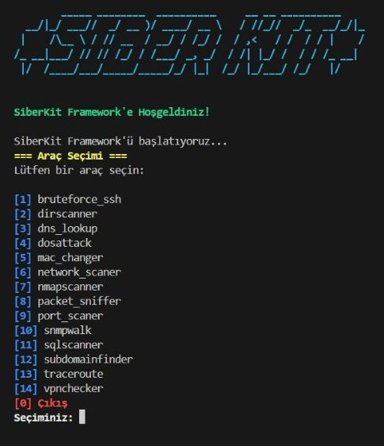

---

### 🔐 SSH Brute Force
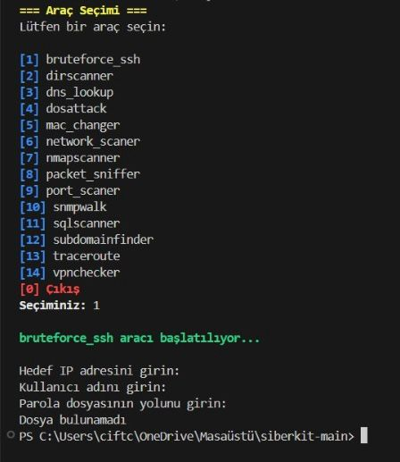

### 📂 Directory Scanner
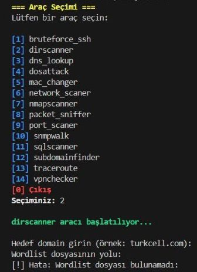

### 🌐 DNS Lookup
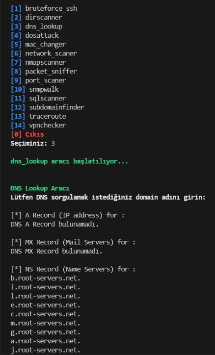

### 💥 DoS Simulation
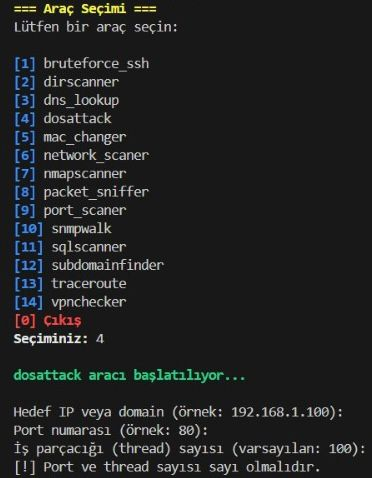

### 🔄 MAC Changer
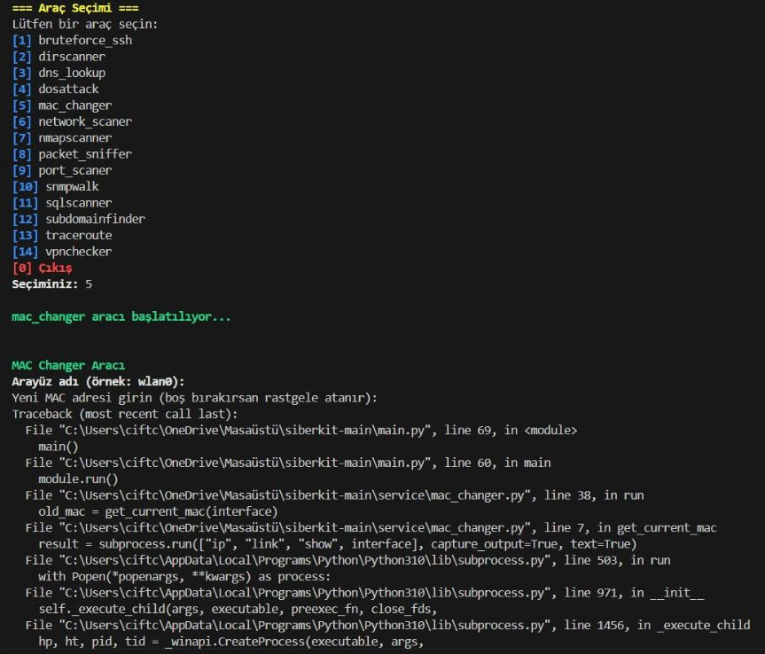

### 📡 Network Scanner
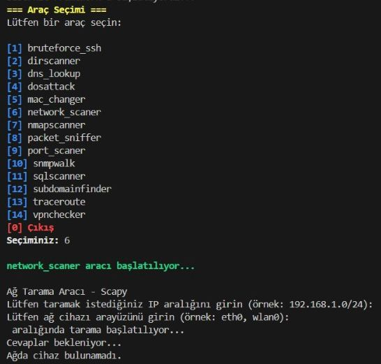

### 🛰️ Nmap Scanner
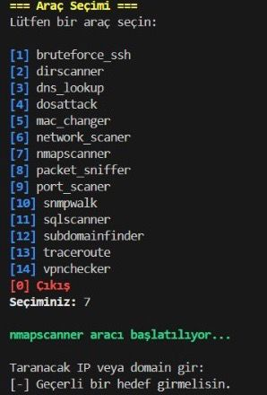

### 📦 Packet Sniffer
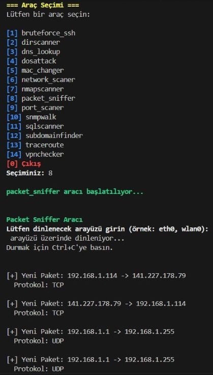

### 🔍 Port Scanner

### 📡 SNMP Walk
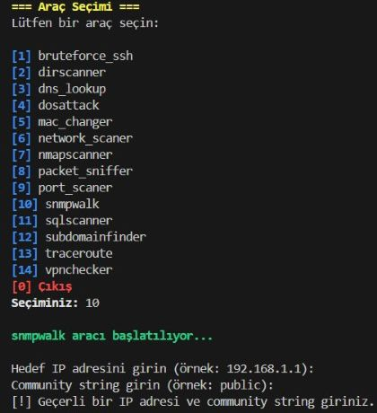

### 🗄️ SQL Scanner
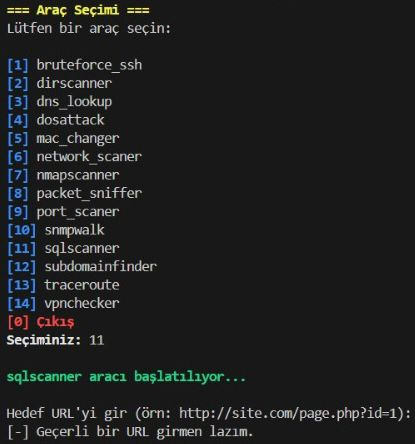

### 🌍 Subdomain Finder
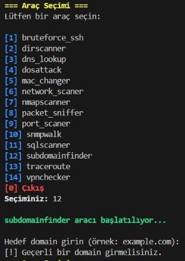

### 🧭 Traceroute
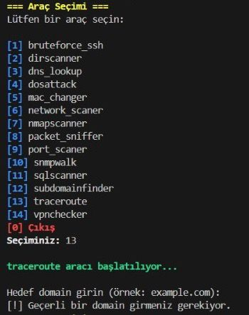

### 🔒 VPN Checker
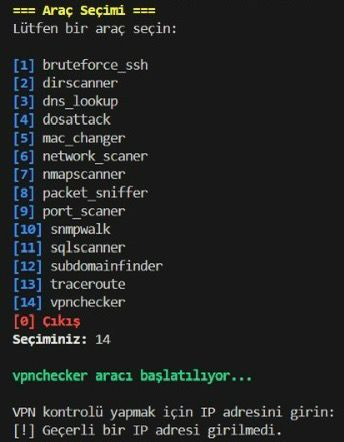

REQUIREMENTS

To install the required libraries, use the dependencies listed in the requirements file.

pip install -r requirements.txt

USAGE

To run the project, execute the main application file.

python main.py

⚠️ LEGAL NOTICE
This project is developed strictly for educational purposes.
Any use on systems without explicit permission is illegal and the responsibility belongs to the user.

DEVELOPER
IEEE FU Computer Society
Cyber Security Project Team
